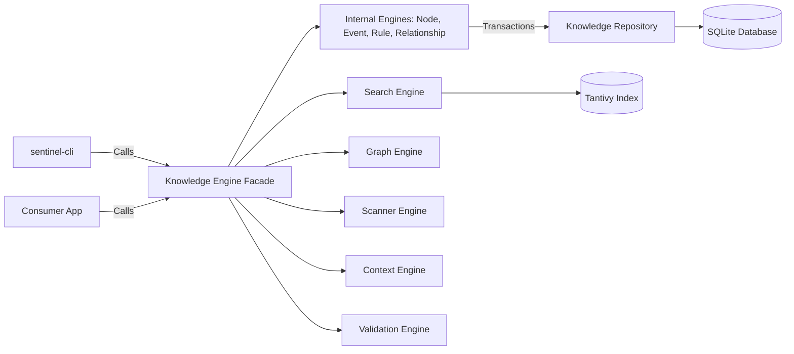

# Sentinel Arc

[](https://github.com/Chandann1905/sentinel-arc/actions/workflows/ci.yml)
[](https://opensource.org/licenses/MIT)

**Sentinel Arc** is an embedded, transactional state-management and event-sourcing engine built in Rust. 

## The Problem
Autonomous agents and complex AI applications struggle with maintaining durable, memory-safe temporal state (what happened, when, and why) across sessions.

## The Solution
Sentinel Arc provides an ACID-compliant memory graph. By strictly separating pure domain representations from SQLite storage implementations, it ensures memory-safe operations, absolute temporal event auditing, and rigorous transaction isolation. Operations never bypass the Engine layer, ensuring all state changes emit synchronous, append-only temporal events.

---

## 🚀 Quick Start (5 Minutes)

We've designed Sentinel Arc to be frictionless to build and test.

### 1. Install Prerequisites
You will need **Rust (1.85+)** and **Cargo**.
* **macOS / Linux / WSL**: `curl --proto '=https' --tlsv1.2 -sSf https://sh.rustup.rs | sh`
* **Windows**: Download `rustup-init.exe` from [rustup.rs](https://rustup.rs).

*(Sentinel Arc strictly uses bundled SQLite (`libsqlite3-sys`), so you do NOT need a local SQL server running).*

### 2. Clone the Repository
```bash
git clone https://github.com/Chandann1905/sentinel-arc.git
cd sentinel-arc
```

### 3. Install the CLI
```bash
cargo install --path crates/cli
```

This installs the `sentinel-cli` binary on your `PATH`. After installation you can invoke it as `sentinel-cli`.

### 4. Initialize a Workspace
```bash
sentinel-cli init
```

This creates the `.sentinel/` directory in the current folder, initializes the SQLite database, and creates the Tantivy search index.

### 5. Scan Your Project
```bash
sentinel-cli scan .
```

The scanner walks the file tree, parses source files with Tree-sitter, and populates the knowledge graph with functions, structs, modules, and their relationships.

### 6. Explore the Knowledge Graph
```bash
# Full-text search
sentinel-cli search "my_function"

# Visualize dependency tree for a node
sentinel-cli graph "my_function"

# Check workspace health
sentinel-cli doctor

# Run architectural validation
sentinel-cli validate

# Display workspace statistics
sentinel-cli stats
```

### 7. Bootstrap and Verify (Alternative)

**Windows (PowerShell):**
```powershell
.\scripts\setup.ps1
```

**macOS / Linux:**
```bash
./scripts/setup.sh
```

*(Alternatively, run `cargo build` and `cargo test` manually).*

---

## 💻 CLI Reference

The `sentinel-cli` is the primary developer interface. See [docs/cli/README.md](docs/cli/README.md) for detailed usage.

| Command                | Description                                               |
|------------------------|-----------------------------------------------------------|
| `sentinel-cli init`           | Initialize a new Sentinel Arc workspace                   |
| `sentinel-cli doctor`         | Verify environment and workspace health                   |
| `sentinel-cli scan [PATH]`    | Scan source code and populate the knowledge graph         |
| `sentinel-cli search <QUERY>` | Full-text search across the knowledge graph               |
| `sentinel-cli graph <QUERY>`  | Visualize dependency tree and impact graph for a node     |
| `sentinel-cli context <INTENT>` | Generate an LLM context package for a given intent      |
| `sentinel-cli validate`       | Run all integrity validators and drift detection          |
| `sentinel-cli stats`          | Display workspace statistics                              |
| `sentinel-cli rebuild-index`  | Rebuild the Tantivy search index from SQLite              |
| `sentinel-cli version`        | Display version and build information                     |
| `sentinel-cli completion <SHELL>` | Generate shell completion scripts (bash, zsh, fish, etc.) |

---

## 🏗️ Architecture & Workspace Layout

Sentinel Arc employs **Domain Driven Design (DDD)** and is structured as a Cargo workspace:

* **`crates/core`** (`sentinel-arc-core`): Pure domain models (`Node`, `Relationship`, `Event`, `Rule`). Zero database dependencies.
* **`crates/knowledge`** (`sentinel-arc-knowledge`): The operational `KnowledgeEngine` facade. Coordinates transactions across the SQLite `KnowledgeRepository`.
* **`crates/graph`** (`sentinel-arc-graph`): Petgraph-backed topology projection and impact analysis.
* **`crates/scanner`** (`sentinel-arc-scanner`): Tree-sitter file system parser for source code ingestion.
* **`crates/context`** (`sentinel-arc-context`): LLM intent resolution and context package generation.
* **`crates/validation`** (`sentinel-arc-validation`): Project health validation and drift detection.
* **`crates/cli`** (`sentinel-cli`): Production developer CLI. Thin wrapper over public engine APIs.
* **`examples/`**: Minimal runnable code demonstrating engine integrations.
* **`docs/`**: Comprehensive developer guides and architectural decisions (ADRs).



## 📚 Developer Guides

New to the project? Start here:
- [Environment Setup](docs/development/setup.md)
- [Building & Compiling](docs/development/building.md)
- [Testing Strategies](docs/development/testing.md)
- [Debugging Guide](docs/development/debugging.md)
- [Repository Layout](docs/development/repository-layout.md)
- [Architecture Deep Dive](docs/development/architecture.md)
- [Troubleshooting & FAQ](docs/development/troubleshooting.md)
- [CLI Reference](docs/cli/README.md)

## 🤝 Contributing

We welcome community contributions!
1. Read our [Contributing Guide](CONTRIBUTING.md).
2. Review our [Code of Conduct](CODE_OF_CONDUCT.md).
3. Ensure all tests and `clippy` checks pass via `cargo test` and `cargo clippy`.

## 📜 License

This project is licensed under the [MIT License](LICENSE).
