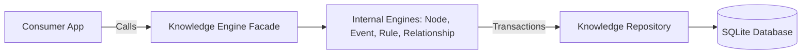

# Sentinel Arc

[](https://github.com/Chandann1905/sentinel-arc/actions/workflows/ci.yml)
[](https://opensource.org/licenses/MIT)

**Sentinel Arc** is an embedded, transactional state-management and event-sourcing engine built in Rust. 

## The Problem
Autonomous agents and complex AI applications struggle with maintaining durable, memory-safe temporal state (what happened, when, and why) across sessions.

## The Solution
Sentinel Arc provides an ACID-compliant memory graph. By strictly separating pure domain representations from SQLite storage implementations, it ensures memory-safe operations, absolute temporal event auditing, and rigorous transaction isolation. Operations never bypass the Engine layer, ensuring all state changes emit synchronous, append-only temporal events.

---

## 🚀 Quick Start (5 Minutes)

We've designed Sentinel Arc to be frictionless to build and test.

### 1. Install Prerequisites
You will need **Rust (1.70.0+)** and **Cargo**.
* **macOS / Linux / WSL**: `curl --proto '=https' --tlsv1.2 -sSf https://sh.rustup.rs | sh`
* **Windows**: Download `rustup-init.exe` from [rustup.rs](https://rustup.rs).

*(Sentinel Arc strictly uses bundled SQLite (`libsqlite3-sys`), so you do NOT need a local SQL server running).*

### 2. Clone the Repository
```bash
git clone https://github.com/Chandann1905/sentinel-arc.git
cd sentinel-arc
```

### 3. Bootstrap and Verify
We provide a setup script that will check your toolchain, compile the project, and run the test suite in memory.

**Windows (PowerShell):**
```powershell
.\scripts\setup.ps1
```

**macOS / Linux:**
```bash
./scripts/setup.sh
```

*(Alternatively, run `cargo build` and `cargo test` manually).*

---

## 🏗️ Architecture & Workspace Layout

Sentinel Arc employs **Domain Driven Design (DDD)** and is structured as a Cargo workspace:

* **`crates/core`** (`sentinel-arc-core`): Pure domain models (`Node`, `Relationship`, `Event`, `Rule`). Zero database dependencies.
* **`crates/knowledge`** (`sentinel-arc-knowledge`): The operational `KnowledgeEngine` facade. Coordinates transactions across the SQLite `KnowledgeRepository`.
* **`crates/search`** (`sentinel-arc-search`): Tantivy-backed full text index. (Merged into core engines)
* **`crates/graph`** (`sentinel-arc-graph`): Petgraph-backed topology projection and impact analysis.
* **`crates/scanner`** (`sentinel-arc-scanner`): Tree-sitter file system parser.
* **`crates/context`** (`sentinel-arc-context`): LLM intent resolution and package generation.
* **`crates/validation`** (`sentinel-arc-validation`): Project health validation and drift detection.
* **`examples/`**: Minimal runnable code demonstrating engine integrations.
* **`docs/`**: Comprehensive developer guides and architectural decisions (ADRs).



## 📚 Developer Guides

New to the project? Start here:
- [Environment Setup](docs/development/setup.md)
- [Building & Compiling](docs/development/building.md)
- [Testing Strategies](docs/development/testing.md)
- [Debugging Guide](docs/development/debugging.md)
- [Repository Layout](docs/development/repository-layout.md)
- [Architecture Deep Dive](docs/development/architecture.md)
- [Troubleshooting & FAQ](docs/development/troubleshooting.md)

## 💻 CLI Roadmap

A dedicated command-line interface (`sentinel-cli`) is planned for upcoming releases. Expected capabilities:
- `cargo run init`: Bootstrap a new SQLite Arc database.
- `cargo run doctor`: Validate integrity of historical events against the current graph state.
- `cargo run validate`: Run the rule engine against the active dataset.

## 🤝 Contributing

We welcome community contributions!
1. Read our [Contributing Guide](CONTRIBUTING.md).
2. Review our [Code of Conduct](CODE_OF_CONDUCT.md).
3. Ensure all tests and `clippy` checks pass via `cargo test` and `cargo clippy`.

## 📜 License

This project is licensed under the [MIT License](LICENSE).
