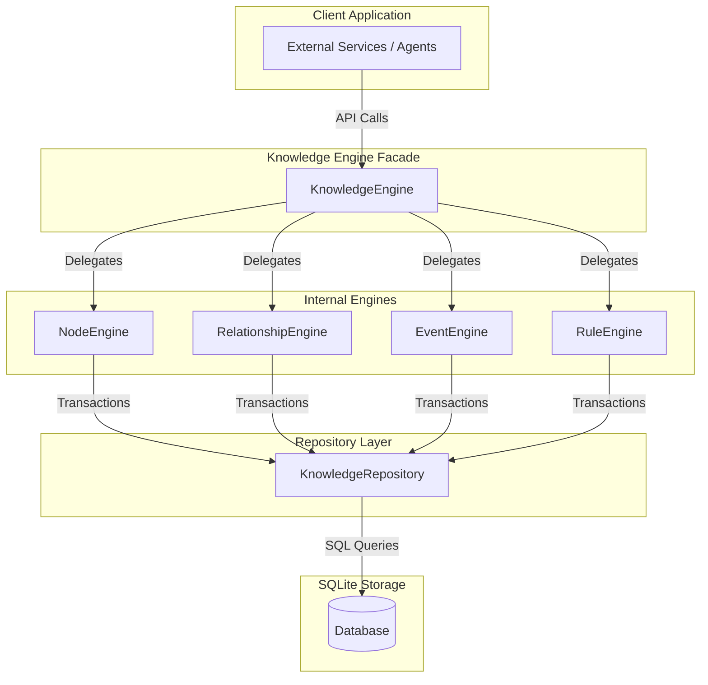

# Sentinel Arc

Sentinel Arc is an embedded state management and event-sourcing foundation built in Rust. It is designed to act as the memory persistence and transaction boundary layer for autonomous agents and complex rule-governed systems.

By strictly separating pure domain representations from storage implementations, Sentinel Arc ensures memory-safe operations, temporal event auditing, and rigorous transaction isolation.

## Architecture Overview

The system strictly adheres to **Domain Driven Design (DDD)** principles and the **Repository Pattern**. Operations never bypass the Engine layer, ensuring that all state changes emit synchronous temporal events.



### Design Principles

1. **Transaction Isolation**: All side effects are encapsulated within atomic database transactions. Creating a node or modifying a relationship strictly appends an audit event within the same transaction.
2. **Encapsulation**: Storage implementation details (`sqlx` queries, migration logic) are hidden behind the `KnowledgeRepository` trait. Internal engines are restricted to `pub(crate)` visibility.
3. **Event Sourcing**: The `EventStore` provides an immutable append-only ledger for all operations, serving as the system's absolute temporal truth.
4. **No External Dependencies in Core**: The `sentinel-arc-core` crate depends solely on `serde`, `uuid`, and `chrono`, ensuring domain models can be shared across web, mobile, and WASM clients.

## Workspace Layout

The repository is structured as a Cargo workspace:

- **`crates/core`**: (`sentinel-arc-core`) Pure domain models (`Node`, `Event`, `Relationship`, `Rule`) and trait definitions. Zero database logic.
- **`crates/knowledge`**: (`sentinel-arc-knowledge`) The operational core, encompassing the `KnowledgeEngine` facade, `NodeEngine`, `EventEngine`, `RuleEngine`, and `RelationshipEngine`. Integrates with the `KnowledgeRepository` for SQLite persistence.

## Quick Start

### Prerequisites
- [Rust](https://www.rust-lang.org/tools/install) (1.70.0 or later)

### Build & Test

```bash
# Clone the repository
git clone https://github.com/Chandann1905/sentinel-arc.git
cd sentinel-arc

# Build the workspace
cargo build --release

# Run the unified test suite
cargo test --workspace
```

## Documentation

- **Architecture Details**: Deep dives into transactions, repository implementations, and system interactions can be found in the `docs/architecture` and `docs/adr` folders.
- **API Reference**: Run `cargo doc --open --no-deps` to explore the comprehensive Rustdoc API reference.

## Testing Strategy

Sentinel Arc uses automated in-memory SQLite instances for testing. Every engine function is tested in isolation against the repository layer, guaranteeing thread-safe, concurrent test execution without database locking overhead.

## Roadmap

1. **HTTP Server API**: Expose the `KnowledgeEngine` via an asynchronous HTTP/REST service.
2. **Context Assembly**: Provide automated projection of surrounding graph contexts (Brain Cards) to supply agents with bounded awareness.
3. **Plugin Engine**: Implement a WASM-based extension architecture for runtime behavior modification.

## Contributing

We welcome community contributions. Please thoroughly review the [Contributing Guide](CONTRIBUTING.md) and [Code of Conduct](CODE_OF_CONDUCT.md) prior to submitting a Pull Request.

## License

This software is released under the [MIT License](LICENSE).
