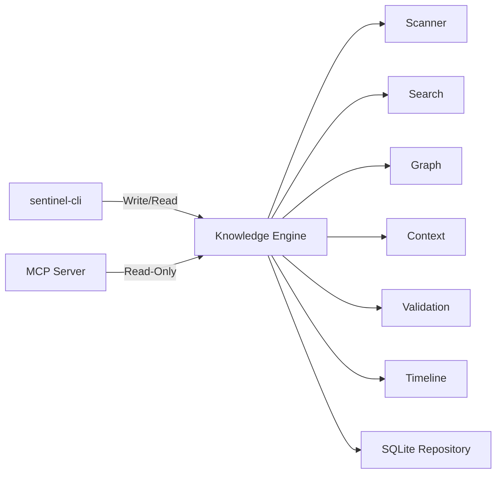

# Sentinel Arc

[](https://github.com/Chandann1905/sentinel-arc/actions/workflows/ci.yml)
[](https://github.com/Chandann1905/sentinel-arc/actions/workflows/release.yml)
[](https://github.com/Chandann1905/sentinel-arc/actions/workflows/audit.yml)
[](https://opensource.org/licenses/MIT)
[](https://rustup.rs/)
[](#)

**Sentinel Arc** is an embedded, transactional state-management and event-sourcing engine built entirely in Rust.

## The Problem
Autonomous agents, complex AI applications, and local knowledge graphs struggle with maintaining durable, memory-safe temporal state across sessions. When an AI modifies a codebase, or an agent makes a decision, tracking exactly *what happened, when, and why* is difficult without relying on heavy external database servers or suffering from data corruption.

## The Solution
Sentinel Arc provides an ACID-compliant memory graph backed natively by SQLite and Tantivy. By strictly separating pure domain representations from storage implementations via Domain-Driven Design (DDD), it ensures absolute memory-safe operations, temporal event auditing, and rigorous transaction isolation. All state changes emit synchronous, append-only events.

---

## 🚀 Quick Start (5 Minutes)

Sentinel Arc is engineered to be frictionless. It bundles its own database and search engine so you **do not** need to install external SQL servers, Redis, or Elasticsearch.

### 1. Installation
You will need **Rust (1.85+)** and **Cargo**.
* **Unix/macOS**: `curl --proto '=https' --tlsv1.2 -sSf https://sh.rustup.rs | sh`
* **Windows**: Download `rustup-init.exe` from [rustup.rs](https://rustup.rs).

Install the `sentinel-cli` globally:
```bash
cargo install --path crates/cli
```

### 2. Initialize your Workspace
Navigate to any project directory and initialize Sentinel Arc:
```bash
cd my_project
sentinel-cli init
```
This sets up a `.sentinel/` database directory tailored to this specific workspace.

### 3. Scan & Explore
Ingest your project's code structure via the built-in Tree-sitter engine:
```bash
sentinel-cli scan .
```

Now you can query the rich Knowledge Graph:
```bash
# Perform lightning-fast full text search
sentinel-cli search "Authenticator"

# Generate LLM context packages
sentinel-cli context "How does the authentication flow work?"

# Validate the architectural health of your project
sentinel-cli validate
```

---

## 🤖 MCP Server Setup

Sentinel Arc functions as a natively compliant Model Context Protocol (MCP) server, allowing AI clients (like Claude Desktop and Cursor) to securely interface with your local repository graph.

### Claude Desktop
Add this to your `claude_desktop_config.json`:
```json
{
  "mcpServers": {
    "sentinel-arc": {
      "command": "sentinel-cli",
      "args": ["mcp"],
      "env": {}
    }
  }
}
```

### Cursor IDE
Add this to your workspace `.cursor/mcp.json`:
```json
{
  "mcpServers": {
    "sentinel-arc": {
      "command": "sentinel-cli",
      "args": ["mcp"]
    }
  }
}
```

For detailed instructions, see the [MCP User Guide](docs/mcp.md).

---

## 🏗️ Architecture & Workspace

Sentinel Arc is strictly modularized into isolated crates ensuring clear boundaries and read-only guarantees for secondary engines.



### Core Crates
* `sentinel-cli`: The production developer interface.
* `sentinel-arc-mcp`: The JSON-RPC 2.0 Model Context Protocol server.
* `sentinel-arc-knowledge`: The primary transactional facade and engine orchestrator.
* `sentinel-arc-core`: Pure domain models with zero database dependencies.
* `sentinel-arc-graph`: Topology projections utilizing `petgraph`.
* `sentinel-arc-scanner`: Tree-sitter powered AST extraction.
* `sentinel-arc-timeline`: Event-sourcing and temporal playback engine.

For a deep dive, see the [Architecture Guide](docs/ARCHITECTURE.md).

---

## 📚 Documentation & Guides

Whether you're integrating Sentinel Arc into an application or using it as a standalone developer tool, our documentation covers it all:

1. [Getting Started](docs/getting_started.md)
2. [CLI Reference](docs/cli.md)
3. [MCP Reference](docs/mcp.md)
4. [Architecture Deep Dive](docs/ARCHITECTURE.md)
5. [Troubleshooting](docs/troubleshooting.md)
6. [FAQ](docs/faq.md)

Explore actionable bash scripts in the [`examples/`](examples/) directory.

---

## 🗺️ Roadmap
We are currently in the **v1.0 Release Candidate** phase.
See what we've completed and what's coming next in our [ROADMAP.md](ROADMAP.md).

## 🤝 Contributing
We love community contributions! We enforce strict linting, safety, and testing requirements to ensure the database remains incorruptible.
1. Check the [Contributing Guide](CONTRIBUTING.md).
2. Familiarize yourself with the [Code of Conduct](CODE_OF_CONDUCT.md).

## 📜 License
Sentinel Arc is open-source software licensed under the [MIT License](LICENSE).
