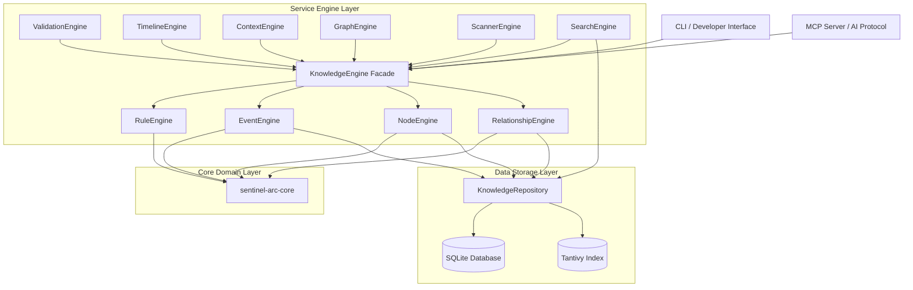

# Sentinel Arc — Architecture Deep Dive

Sentinel Arc is engineered using a strict **Domain-Driven Design (DDD)** philosophy. The architecture ensures that domain logic remains absolutely pure, isolated from the side-effects of databases, network protocols, or file systems.

---

## High-Level Dependency Graph

---

## 1. Core Domain (`sentinel-arc-core`)
At the absolute center of the application sits the `sentinel-arc-core` crate.
It contains the basic definitions: `Node`, `Relationship`, `Event`, `Rule`.
**Invariant:** This crate possesses *zero* database dependencies. It does not know about SQLite, `sqlx`, or Tantivy.

## 2. Storage & Repository
Storage operations are pushed to the outermost boundaries. The `KnowledgeRepository` handles mapping the pure Domain Models into SQLite queries and Tantivy index insertions. Transactions are initiated and committed exclusively at this layer.

## 3. The Knowledge Engine (The Facade)
The `KnowledgeEngine` acts as the single point of entry for all state mutation. 
It abstracts away the `NodeEngine`, `EventEngine`, `RelationshipEngine`, and `RuleEngine`.
External interfaces (like the CLI or the MCP Server) **must never** communicate with the Repository layer directly. They must route their requests through the `KnowledgeEngine`.

## 4. Sub-Engines & Flow Guarantees

### Event Flow (Event Sourcing)
Mutations requested against the `KnowledgeEngine` are mapped to events by the repository layer during transaction execution. This yields an append-only chronological history (Timeline) of structural modifications that occurred inside the workspace database.

### Context Generation Flow
The `ContextEngine` retrieves data via the `KnowledgeEngine` and packages it into token-optimized payloads for Large Language Models.
**Guarantee:** The `ContextEngine` is read-only. It cannot mutate state.

### Timeline Architecture
The `TimelineEngine` reads from the `EventEngine` to generate historical playback.
**Guarantee:** The `TimelineEngine` is strictly read-only.

### Validation Flow
The `ValidationEngine` acts as an integrity checker, comparing the in-memory `GraphProjection` against the raw file system. It identifies drift between the source code on disk and the database representations.

### MCP Server
The `sentinel-arc-mcp` crate translates incoming JSON-RPC 2.0 requests into engine calls. It acts as the HTTP/Stdio transport layer enabling AI integration.
**Guarantee:** The MCP Server contains no duplicated business logic. All tool calls map directly to existing public Engine methods.
