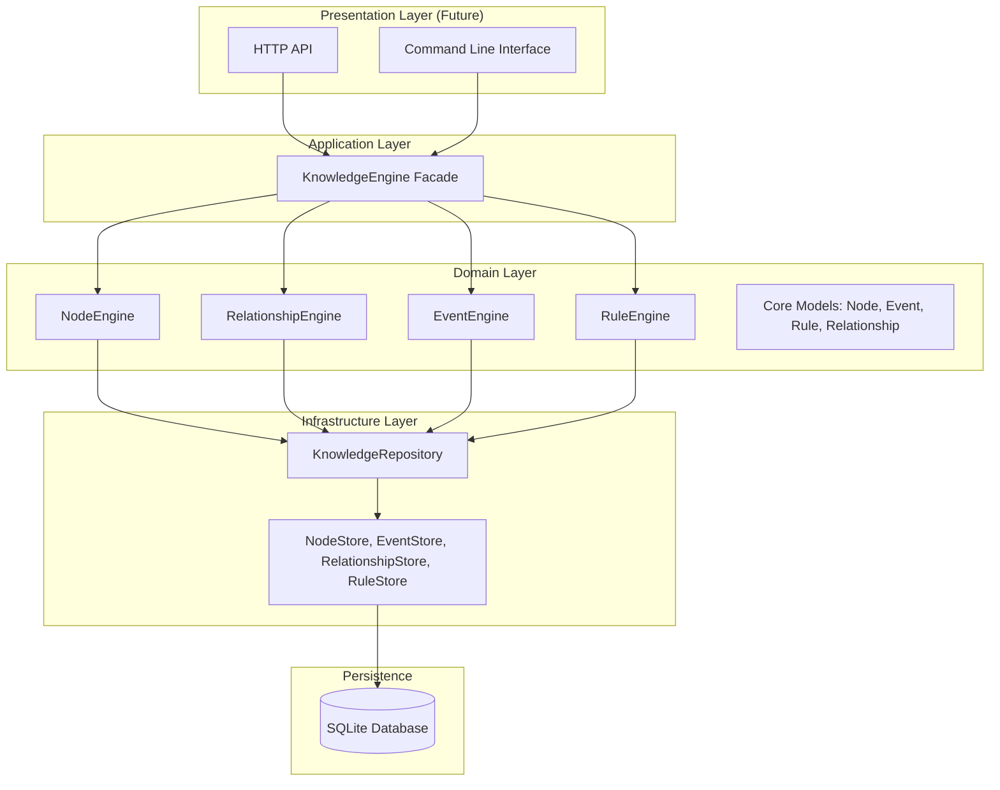

# System Architecture

Sentinel Arc operates on a strict, layered architecture emphasizing immutability through event-sourcing and separation of concerns through Domain Driven Design (DDD).

## Architecture Layers

### 1. Presentation Layer
Currently unimplemented. Will house the HTTP API, WebSockets, and CLI. This layer will never interact directly with the stores; it must interface exclusively with the `KnowledgeEngine`.

### 2. Application Layer
The `KnowledgeEngine` acts as the single point of entry. It abstracts away the internal component orchestration, providing a clean, unified API for higher-level consumers.

### 3. Domain Layer
Contains the isolated engines responsible for business logic:
- `NodeEngine`: Enforces node validation, creation, and state transitions.
- `RelationshipEngine`: Validates source-target existence and enforces cyclic constraints.
- `EventEngine`: Provides absolute temporal event auditing.
- `RuleEngine`: Enforces dynamic business constraints.

Core Models are defined in `sentinel-arc-core` and possess no persistence awareness.

### 4. Infrastructure Layer
The `KnowledgeRepository` handles database connection pooling and asynchronous transaction boundaries via `sqlx`. It initializes the specialized Data Access Objects (Stores) required for persistence.
