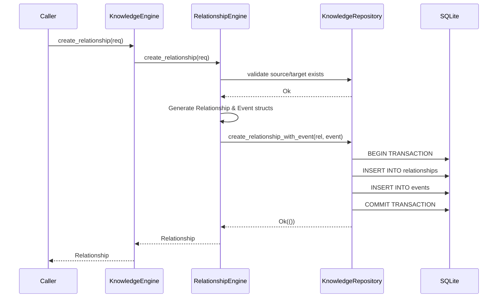

# Transaction Boundaries

Sentinel Arc mandates that complex state modifications are atomic. Partial successes are forbidden.

## The Problem
A standard operation like `create_relationship` involves:
1. Validating the Source Node exists.
2. Validating the Target Node exists.
3. Inserting the Relationship record.
4. Inserting the corresponding Audit Event.

If step 4 fails due to disk constraints, step 3 cannot be allowed to persist.

## The Solution

Transactions are executed entirely within the `KnowledgeRepository`, not the Engines. Engines prepare the domain models (`Relationship` and `Event`) and pass them to the repository for atomic commit.

If any query fails during the `KnowledgeRepository` execution, the `sqlx::Transaction` is dropped, triggering an immediate database rollback.
