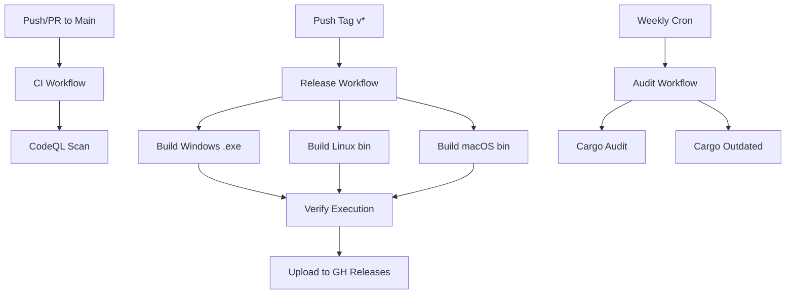

# Sentinel Arc — CI/CD Architecture (Pre-v1.0)

This document outlines the Continuous Integration and Continuous Deployment (CI/CD) pipelines engineered for Sentinel Arc using GitHub Actions.

## Workflow Architecture

## Workflows Overview

We maintain four primary pipelines designed for speed, verification, and automation:

1. **Continuous Integration (`ci.yml`)**: Evaluates every PR and commit.
2. **Release Automation (`release.yml`)**: Automates cross-platform builds and deployment.
3. **Security Audit (`audit.yml`)**: Secures the supply chain using `cargo-audit`.
4. **CodeQL Scan (`codeql.yml`)**: Static application security testing.

---

## 1. Continuous Integration (`ci.yml`)

Triggered on:
- `push` to `main`
- `pull_request` against `main`

### Matrix and Caching
- **Matrix OS**: Ubuntu Linux, Windows, macOS.
- **Caching**: Leverages `Swatinem/rust-cache@v2`. This caches Cargo registries, git repositories, and compiled target artifacts, drastically reducing build times (avoiding duplicate full-compilations).

### Validation Steps
The pipeline is strictly configured to `fail-fast`. It executes:
1. `cargo fmt --all -- --check`
2. `cargo clippy --workspace --all-targets --all-features -- -D warnings`
3. `cargo test --workspace --all-features`
4. `cargo doc --workspace --no-deps`

Any rustdoc, formatting, or compilation warning is fatal.

---

## 2. Release Automation (`release.yml`)

Triggered on:
- Pushing a new git tag matching `v*` (e.g., `v1.0.0`).

### Artifact Generation
Generates release-optimized binaries (`cargo build --release`) across all three major platforms.
- `sentinel-cli-linux-x86_64.tar.gz`
- `sentinel-cli-windows-x86_64.zip`
- `sentinel-cli-macos-x86_64.tar.gz`

### Verification Integrity
Before publishing, the pipeline guarantees version synchronization:
1. It executes `./target/release/sentinel-cli --version` (or `sentinel-cli.exe` on Windows).
2. It strips the `v` from `GITHUB_REF_NAME` (the tag).
3. It fails if the binary's version output does not strictly match the tag. This guarantees that `Cargo.toml` was properly bumped before the tag was created.

### Deployment
Uses `softprops/action-gh-release` to seamlessly attach the compressed binaries to the GitHub Release associated with the tag. Note that this action requires `contents: write` repository permissions to function.

---

## 3. Security Audit (`audit.yml`)

Triggered on:
- `push` / `pull_request` modifying `Cargo.lock`
- Weekly schedule (`cron`)

### Scanners
- **RustSec Audit (`cargo-audit`)**: Scans `Cargo.lock` against the RustSec Advisory Database. If a CVE is found in any dependency, the pipeline fails immediately.
- **Dependency Drift (`cargo-outdated`)**: Executes in a report-only format. It displays stale dependencies but does not fail the build.

---

## Local vs GitHub Execution

*Important Note:* While the commands outlined in these workflows (`cargo test`, `cargo fmt`, `clippy`, etc.) have been fully verified **locally** across the workspace, the specific GitHub workflow files (`.yml`) remain pending their first execution on a live GitHub Actions runner upon the v1.0 tag. 

## Troubleshooting

1. **Clippy Failure in CI**: Ensure you are running `cargo clippy --workspace --all-targets --all-features -- -D warnings` locally before pushing.
2. **Release Version Mismatch**: If `release.yml` fails during the *Verify Version Consistency* step, you likely tagged a commit without bumping `version` in `Cargo.toml`.
3. **Cache Invalidation**: If the `Swatinem/rust-cache` action is failing, you can bump the `shared-key` string in the workflows.
